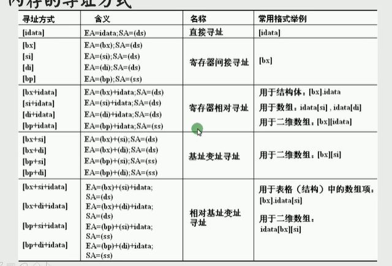

[bx+idata]

```assembly
mov ax,[bx+200]
等价于
mov ax,[200+bx]
mov ax,200[bx]
mov ax,[bx].200
```

 

SI和DI寄存器 常执行与地址相关的操作 类似bx

source index

destination index

bx常作为基址寄存器使用，可以拆分为h和l

而si和di不能

例如复制字符

[bx+si]

[bx+di]

[bx+si+idata]

[bx+di+idata]

二重循环

外层循环的cx先放在dx中，但是dx也被用了怎么办，放在内存中就可以了。

或者使用栈保存数据。




只有 bx,bp,si,di可以用[]方括号对内存进行寻址

其他不行的原因是电路没有设计

```assembly
mov ax,[bx+bp]
mov ax,[si+di]
这两个都是错误指令
```

bx默认指ds段

bp默认指ss段


