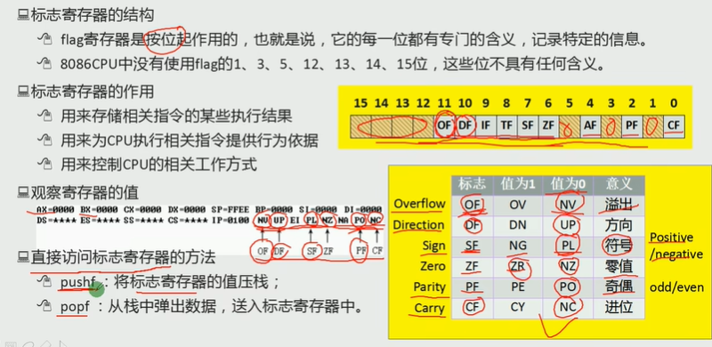
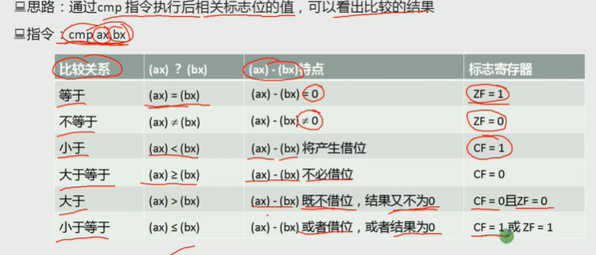
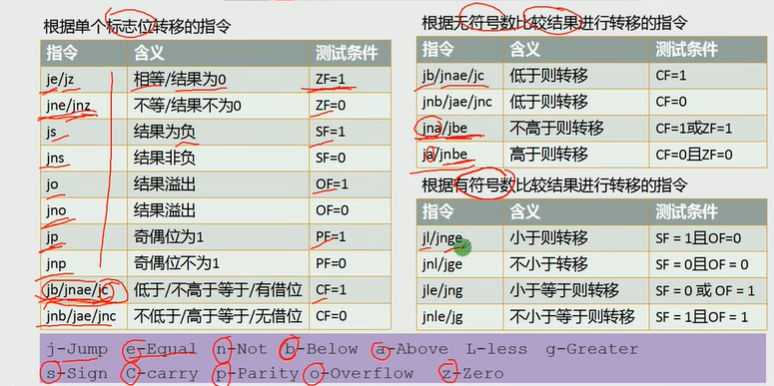
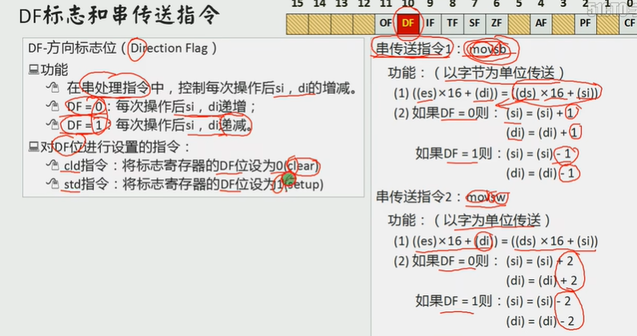

psw/flag



奇偶就看1的个数是否是奇偶

补码就是取反后加一

OF溢出只是对有符号数运算而言有意义

CF是对无符号数运算有意义的。

至于你看这个数到底是什么，是程序员的事情


带进位加法指令 add carry

```assembly
adc ax,bx; (ax) = (ax) + (bx) + CF
```

应用 大数相加

低16位相加，利用cf记录是否有进位，然后高十六位再加

sbb : sub borrow

```assembly
sbb ax, bx; (ax) = (ax) - (bx) - CF
```


```ass
cmp ax, bx; (ax) - (bx) 然后影响标位寄存器
```



有符号数，只需要再判断溢出flag







mov string byte

mov string word

```assembly
rep 指令; 根据cx的值重复后面的指令
rep movsb; s:movsb; loop s
```


