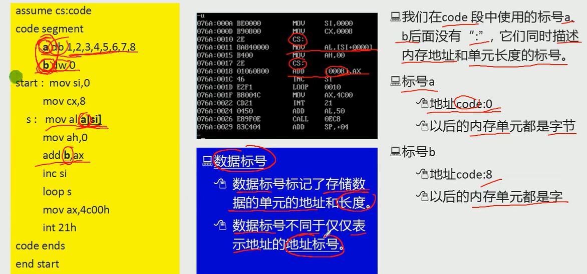
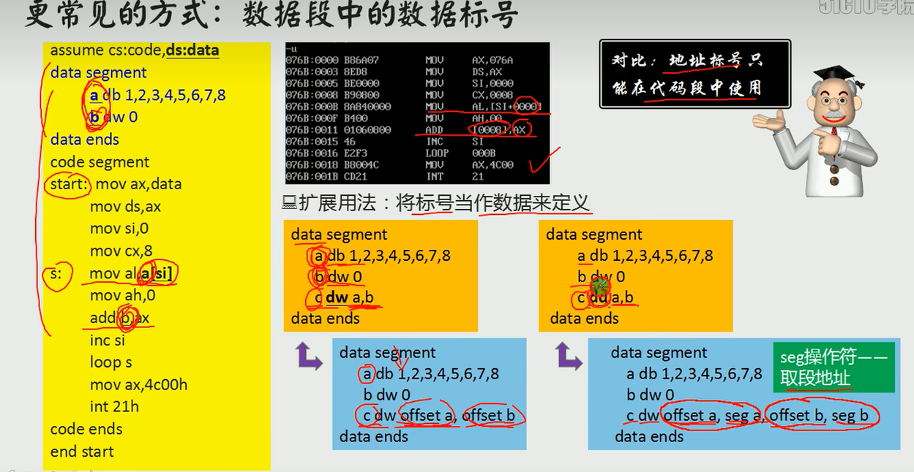
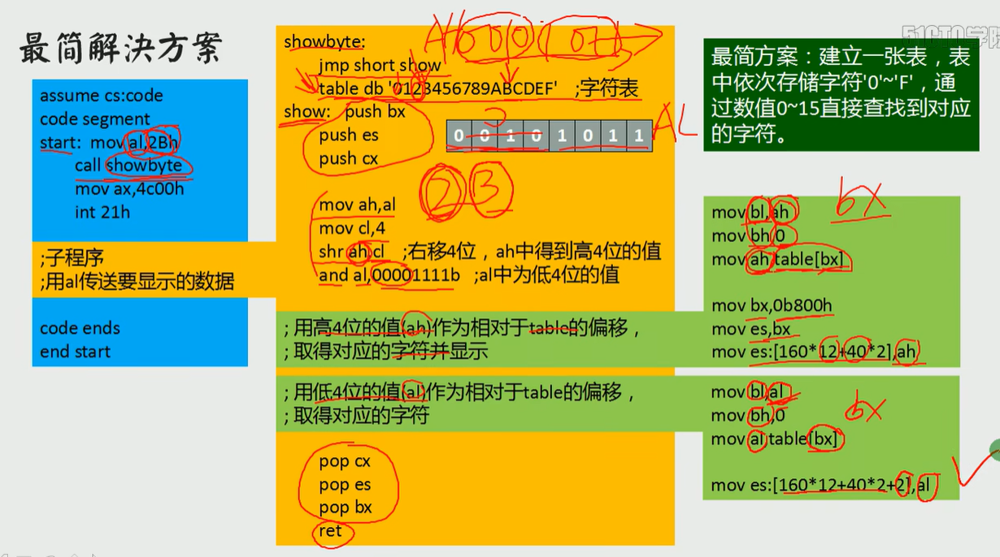
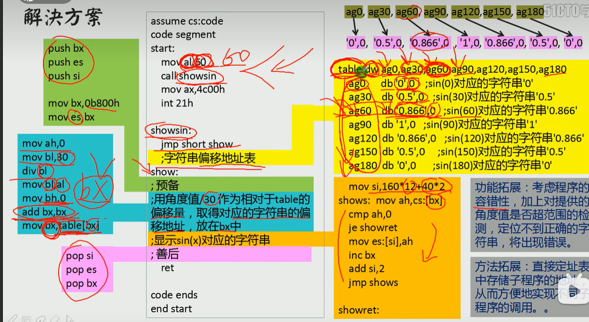
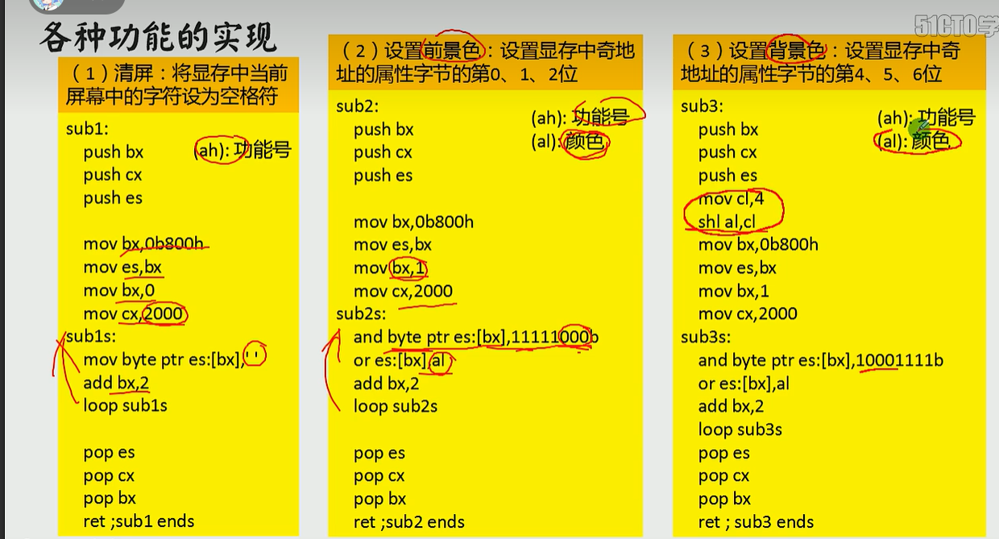
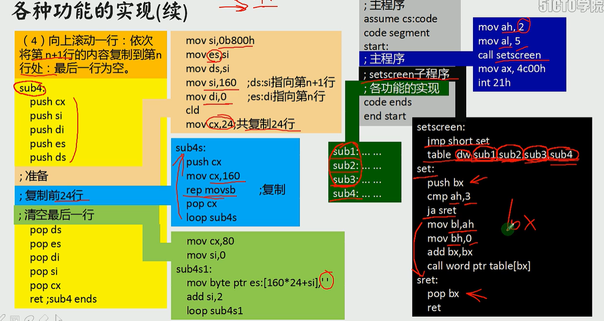

显示的原理

屏幕上的内容 = 显存中的数据 cpu操作显存，从而显示

内存中有一部分时显存地址空间

80*25屏幕 80列 25行

显示缓冲区

每个元素都是两个字节

低位字节显示符号 ascii码

高位字节显示属性

| 7    | 6    | 5    | 4    | 3    | 2    | 1    | 0    |
| ---- | ---- | ---- | ---- | ---- | ---- | ---- | ---- |
| BL   | R    | G    | B    | I    | R    | G    | B    |
| 闪烁 |      | 背景 |      | 高亮 |      | 前景 |      |

函数指针

