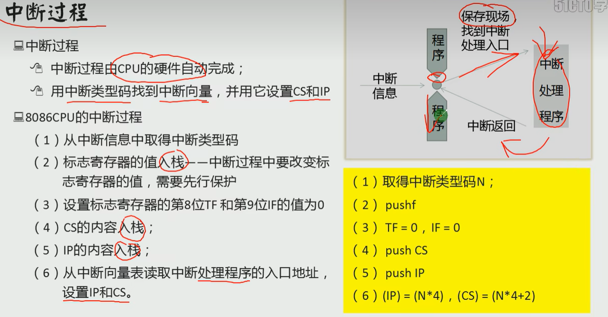
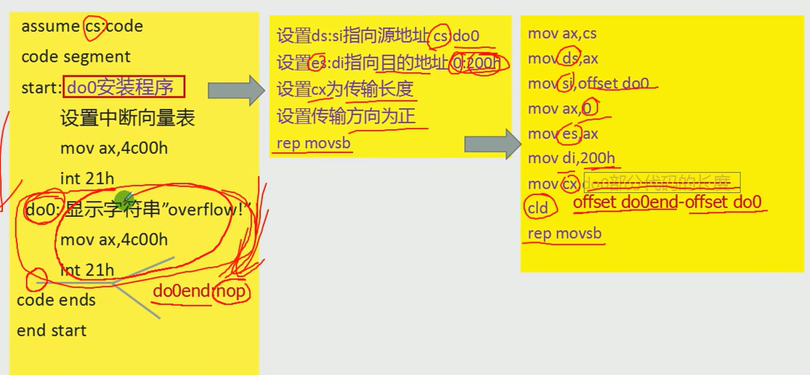
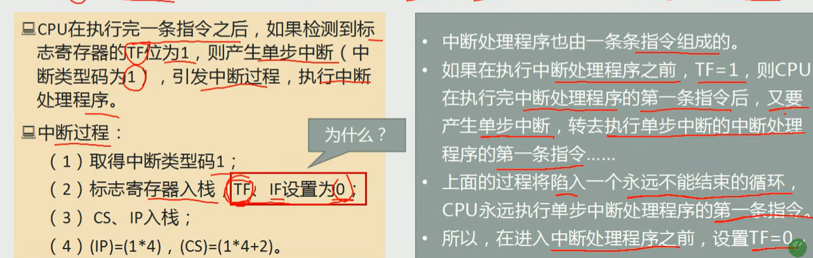
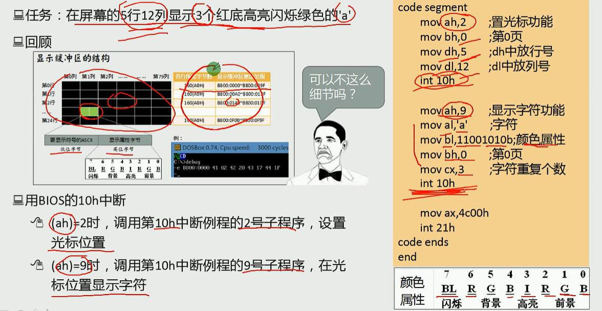
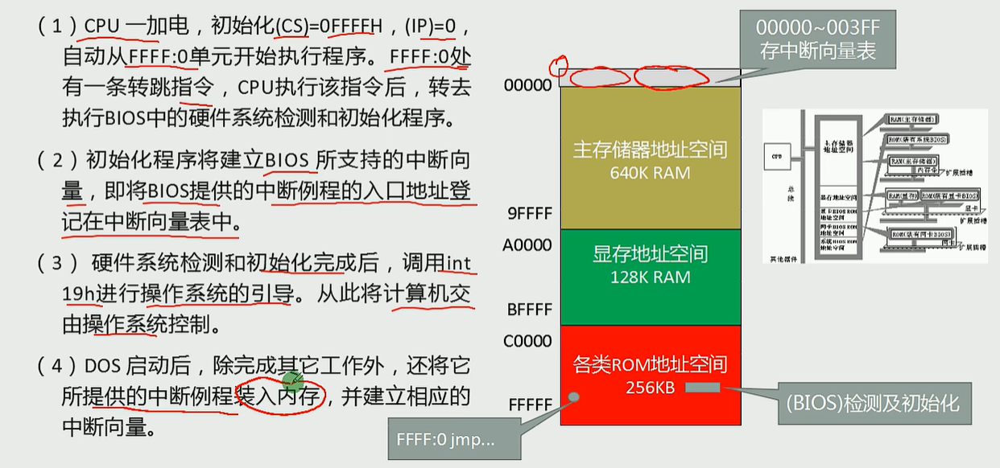

中断:CPU不再接着(刚执行完的指令)向下执行，而是转去处理中断信息。

内中断:由CPU内部发生的事件而引起的中断

外中断:由外部设备发生的事件引起的中断


8086内中断

除法错误 中断码：0

单步执行 中断码：1

执行into指令 中断码：4

执行int指令 int n n是中断类型码


 lea是取相应标号的地址

int 21h 是指使用ah中的中断码对应的程序


中断处理程序在哪。

中断向量表，查表

包含了很多cs 和 ip 保存了中断程序的入口

(ip) = (n*4)

(cs) = (n*4+2)

就是第n个程序的地址


中断过程由cpu的硬件自动完成

用中断类型码找到中断向量表找到中断向量，设置cs和ip




中断程序常存内存

实现除0的中断

第一个确定这个程序的位置，绕过操作系统

```assembly

```




单步中断过程与处理

TF 陷阱标志，用于调试时的单步方式操作，当TF=1时，每条指令执行完后产生陷阱，由系统控制计算机；当TF=0时，cpu正常工作，不产生陷阱

IF 中断表示，IF = 1时，允许cpu响应可屏蔽中断请求，反之，关闭中断




有的时候cpu执行完当前指令后，及时发生中断，也不会响应

比如设置栈

```assembly
mov ax 1000
mov ss ax
mov sp 10
```

对于ss和sp的操作是连续完成的，不会被中断


int指令和call差不多

```assembly
int n; 等价于 pushf; push cs; push ip
iret;等价于 pop ip; pop cs; popf
```


BIOS中的主要内容

(1)硬件系统的检测和初始化程序

(2)外部中断和内部中断的中断例程

(3)用于对硬件设备进行I/0操作的中断例程

(4)其他和硬件系统相关的中断例程

例子

在屏幕的5行12列显示3个红底高亮闪烁绿色'a'




bios中断类有显示服务，磁盘，串行口，杂项，键盘，并行口，时钟，直接系统服务

还有dos中断，系统级服务 查手册就行

dos中断依赖bios中断


编程可以直接操作bios内存，或者dos中断，或者bios中断



