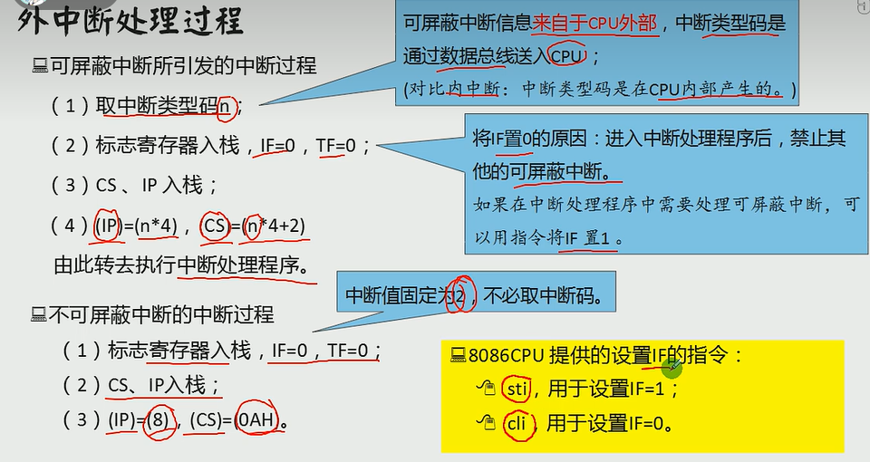

端口访问

程序直接访问外设，就是通过端口

cpu的邻居

- 寄存器
- 内存单元
- 端口 
  - 各种接口卡，网卡和显卡
  - 主板上的接口芯片
  - 其他芯片

读写端口的指令

```assembly
in : cpu从端口读取数据
out : cpu往端口写入数据
```

各种芯片工作时，都有一些寄存器由cpu读写

从cpu角度，将各寄存器当端口，并统一编制

cpu用统一的方法和各种设备通信


在in和out 指令中，只能使用ax 或al来存放从端口中读入的数据或要发送到端口中的数据。访问8 位端口时用al，访问16 位端口时用ax。


CMOS RAM 芯片

(1)包含一个实时钟和一个有428个存储单元的RAM存储器

(2)128 个字节的 RAM 中存储:内部实时钟、系统配置信息,相关的程序(用于开机时配置系统信息)

(3)CMOS RAM 芯片靠电池供电，关机后其内部的实时钟仍可正常工作 ，RAM 中的信息不丢失。

(4)该芯片内部有两个端口，端口地址为70h和71h，CPU通过这两个端口读写CMOS RAM。

- 70h地址端口，存放要访问的CMOS RAM单元的地址
- 71h数据端口，存放从选定的单元中读取的数据，或要写入到其中的数据。

(5)读取CMOS RAM的两个步骤

- 将要读取的单元地址送入70h地址端口
- 从数据端口71h读出指定单元的内容。


CPU 在执行指令过程中，可以检测到发送过来的中断信息，引发中断过程，处理外设的输入。

外中断

**可屏蔽中断**

可屏蔽中断是CPU 可以不响应的外中断。CPU 是否响应可屏蔽中断，要看标志寄存器的IF 位的设置。

当CPU检测到可屏蔽中断信息时

- 如果IF=1，则CPU在执行完当前指令后响应中断，引发中断过程;
- 如果IF=0, 则不响应可屏蔽中断。

**不可屏蔽中断**

- 不可屏蔽中断是CPU 必须响应的外中断。
- 当CPU检测到不可屏蔽中断信息时，则在执行完当前指令后，立即响应，引发中断过程。
- 对于8086CPU不可屏蔽中断的中断类型码固定为2

几乎所有由外设引发的外中断，都是可屏蔽中断





 延时可以使用空循环

改写中断程序，让他指向我们自定义的


